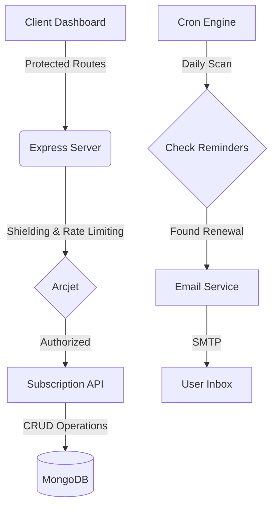

# 🚀 Subscription Tracker: Production-Ready Backend System

<div align="center">
  

  [](https://nodejs.org/)
  [](https://expressjs.com/)
  [](https://www.mongodb.com/)
  [](https://arcjet.com/)
  [](https://www.docker.com/)

  **A modern, scalable, and secure backend platform built with industry-standard practices.**
</div>

---

## 💎 Features at a Glance

- **🛡️ Shielded Architecture**: Integrated with **Arcjet** for bot protection, rate limiting, and request shielding.
- **🔑 Secure Authentication**: Professional JWT-based auth flow with salted & hashed passwords.
- **🔔 Intelligent Notifications**: Automated daily email workflows for renewal reminders.
- **📊 Real-time Dashboard**: A sleek, glassmorphic UI for visual data verification.
- **🏗️ Developer Experience**: Fully containerized with **Docker** and automated with **ESLint/Prettier**.

---

## 🛠️ Tech Stack & Tooling

| Category | Technology |
| :--- | :--- |
| **Core** | Node.js, Express.js (CommonJS) |
| **Database** | MongoDB & Mongoose |
| **Security** | Arcjet, JsonWebToken, Bcrypt.js |
| **Automation** | Node-cron, Nodemailer |
| **DevOps** | Docker, Docker Compose |
| **Quality** | ESLint, Prettier |

---

## 📐 System Architecture



---

## 🚀 Getting Started

### 1. Prerequisites
- **Node.js** (v18+)
- **Docker** (Optional, for containerized run)
- A **MongoDB Atlas** account (or local MongoDB)

### 2. Installation
```bash
git clone https://github.com/Thenuja-Hansana/subscription-tracker-fullstack.git
cd subscription-tracker
npm install
```

### 3. Environment Setup
Create a `.env` file in the root directory and add:
```env
PORT=5000
MONGODB_URI=your_mongodb_uri
JWT_SECRET=your_jwt_secret
JWT_EXPIRES_IN=1d
ARCJET_KEY=your_arcjet_key
ARCJET_ENV=development
EMAIL_USER=your_email
EMAIL_PASSWORD=your_app_password
```

### 4. Running the App
```bash
# Development Mode
npm run dev

# Professional Formatting
npm run format
npm run lint

# Docker Mode
docker-compose up --build
```

---

## 📜 Development History
This project was built with a disciplined engineering approach, featuring a comprehensive development history spread across various phases of implementation.

<div align="center">
  <sub>Built with ❤️ by Team Antigravity & [User]</sub>
</div>
